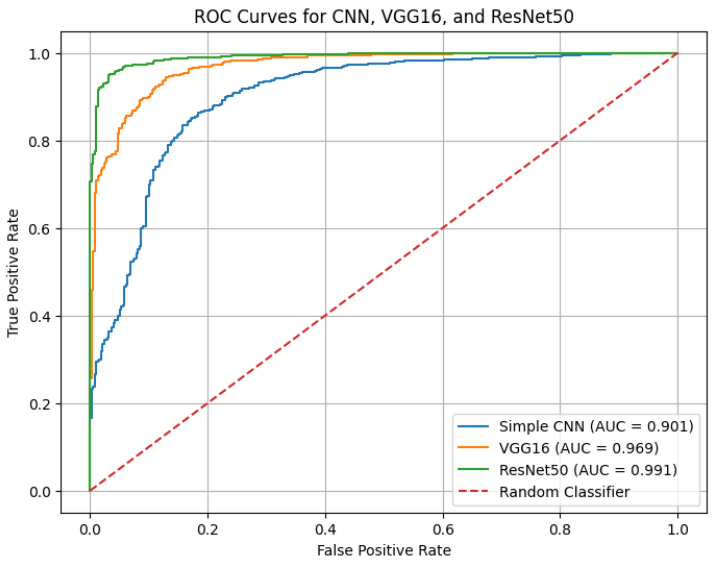
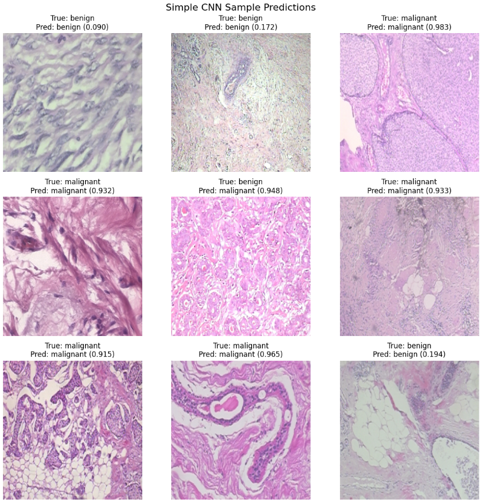
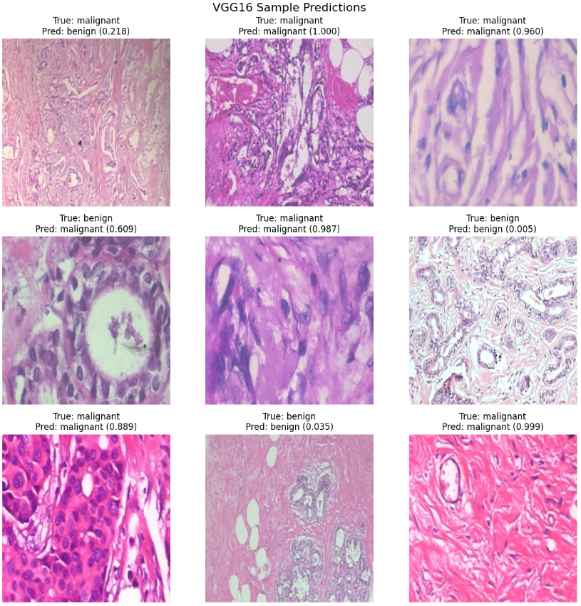
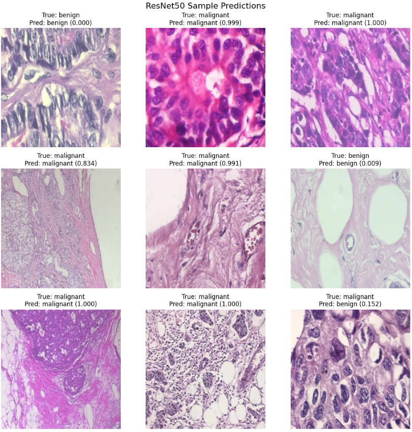
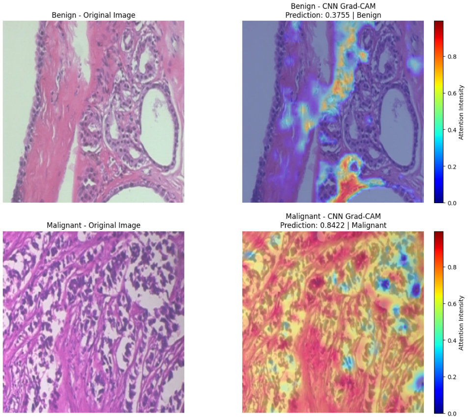
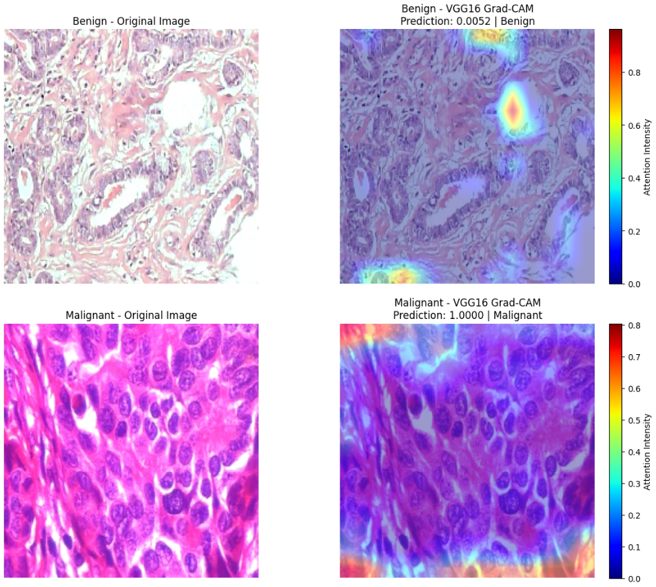
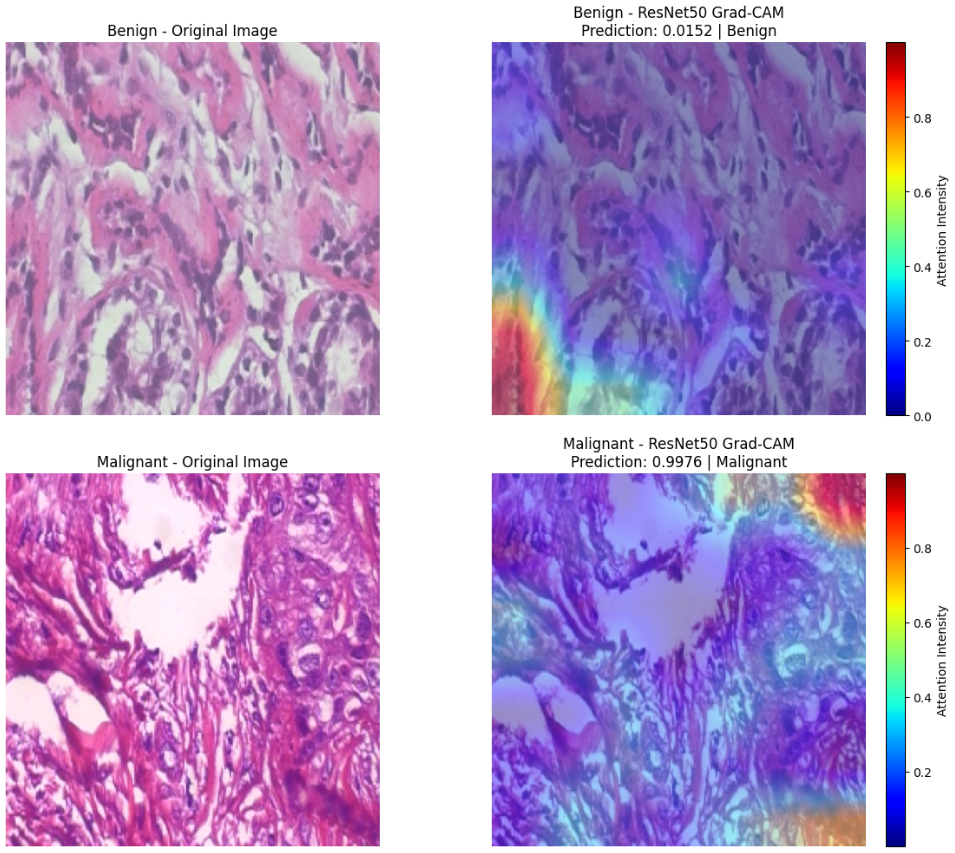

# Breast Cancer Histopathology Classification

This project focuses on classifying breast cancer histopathology images into two classes: **benign** and **malignant**. The main problem is that breast cancer diagnosis from histopathology images requires expert medical interpretation, and deep learning can help support this process by learning visual tissue patterns such as texture, color, cell structure, and tissue arrangement.

The goal of this project is to build and compare three deep learning models for binary image classification:

* Simple CNN
* VGG16
* ResNet50

The project also includes visual model interpretation using **ROC-AUC curves**, **sample predictions**, and **Grad-CAM heatmaps** to better understand how the models behave.

---

## Problem Statement

Breast cancer diagnosis often depends on histopathological examination of tissue images. These images can contain complex visual patterns that indicate whether tissue is benign or malignant.

The main question of this project is:

> Can deep learning models accurately classify breast cancer histopathology images as benign or malignant and support disease diagnosis?

This project does not aim to replace medical experts. Instead, it explores how deep learning models can be used as decision-support tools for researchers, doctors, and pathologists.

---

## Dataset

The dataset is not included in this repository because it is large.

This project uses the Breast Cancer Histopathology dataset from Kaggle, based on the BreaKHis dataset.

## Dataset Source

Kaggle dataset:

https://www.kaggle.com/datasets/anaselmasry/breast-cancer-dataset?select=BreaKHis_Total_dataset

Research paper:

https://pubmed.ncbi.nlm.nih.gov/26540668/

## Dataset Description

The dataset contains histopathological breast cancer images classified into two classes:

* Benign
* Malignant

The Kaggle version used in this project contains approximately **7,783 images**:

* 2,479 benign images
* 5,304 malignant images

The task is binary image classification, where the model predicts whether a histopathology image is benign or malignant.

---

## Repository Structure

```text
breast-cancer-histopathology-classification/
│
├── README.md
├── requirements.txt
├── .gitignore
├── breast_cancer_histopathology_classification.ipynb
│
├── data/
│   └── README.md
│
├── models/
│   ├── README.md
│   ├── simple_cnn_model.keras
│   ├── vgg16_model.keras
│   └── resnet50_model.keras
│
└── visualizations/
    ├── roc.png
    ├── sample_simple_cnn.png
    ├── sample_vgg.png
    ├── sample_resnet.png
    ├── grad_cam_simple_cnn.png
    ├── grad_cam_vgg.png
    └── grad_cam_resnet.png
```

---

## Files Description

### `breast_cancer_histopathology_classification.ipynb`

This is the main notebook of the project.

It includes:

* Loading the breast cancer histopathology image dataset.
* Splitting the dataset into training, validation, and testing sets.
* Preprocessing images.
* Training three deep learning models.
* Evaluating models using classification metrics.
* Plotting ROC-AUC curves.
* Displaying sample predictions.
* Applying Grad-CAM for explainable AI.

---

### `data/README.md`

This file explains the dataset source, the expected local dataset structure, and why the dataset is not uploaded to GitHub.

---

### `models/`

This folder contains the trained Keras model files:

* `simple_cnn_model.keras`
* `vgg16_model.keras`
* `resnet50_model.keras`

If these files are not included because of file size limits, they can be regenerated by running the notebook.

---

### `visualizations/`

This folder contains the visual outputs used in the README:

* ROC-AUC curve
* Sample predictions for each model
* Grad-CAM heatmaps for each model

---

## Methodology

## 1. Data Loading

The dataset was loaded from image folders. Each image belongs to one of two classes:

* Benign
* Malignant

The labels were treated as binary labels for binary classification.

---

## 2. Image Preprocessing

All images were resized to:

```text
224 × 224 pixels
```

This was done because CNN models require fixed input image dimensions.

The images were loaded in batches of:

```text
32 images per batch
```

For the Simple CNN model, pixel values were normalized to improve training stability.

For the transfer learning models, VGG16 and ResNet50, model-specific preprocessing functions were applied because these models expect the input format used during their original pretraining.

---

## 3. Data Splitting

The dataset was split into:

* 70% training data
* 15% validation data
* 15% testing data

The training set was used to train the models.
The validation set was used to monitor performance during training.
The test set was used for final evaluation on unseen images.

---

# Models Used

## 1. Simple CNN

The Simple CNN model was used as a baseline model trained from scratch.

It learned image features directly from the breast cancer histopathology images using convolution and pooling layers.

### Why Simple CNN was used

Simple CNN was used to provide a baseline comparison. Since it was trained from scratch, it allowed the project to compare a custom model with transfer learning models.

### Simple CNN Results

| Metric              | Value |
| ------------------- | ----: |
| Training Accuracy   | 85.2% |
| Validation Accuracy | 86.7% |
| Test Accuracy       | 87.1% |
| Precision           | 89.2% |
| Recall              | 92.4% |
| F1-score            | 90.8% |
| AUC                 |  0.91 |

### Simple CNN Interpretation

Simple CNN achieved good performance for a model trained from scratch. It was able to detect many malignant cases, as shown by its recall of 92.4%.

However, it was weaker than VGG16 and ResNet50. This is expected because the Simple CNN did not benefit from pretrained feature extraction. It had to learn all tissue patterns only from the project dataset.

Clinically, the model may support diagnosis research, but it should not be used as a standalone diagnostic tool.

---

## 2. VGG16

VGG16 is a transfer learning model. It uses a pretrained convolutional base and adds classification layers on top for the benign vs malignant classification task.

### Why VGG16 was used

VGG16 was used because it is a well-known CNN architecture that can extract strong visual features from images. Since medical image datasets are often limited in size, transfer learning can improve performance by using knowledge learned from large image datasets.

### VGG16 Results

| Metric              | Value |
| ------------------- | ----: |
| Training Accuracy   | 94.7% |
| Validation Accuracy | 91.7% |
| Test Accuracy       | 91.4% |
| Precision           | 92.5% |
| Recall              | 94.9% |
| F1-score            | 93.7% |
| AUC                 |  0.96 |

### VGG16 Interpretation

VGG16 performed better than Simple CNN in all major evaluation metrics. It achieved higher accuracy, precision, recall, F1-score, and AUC.

The recall of 94.9% means that VGG16 detected a larger proportion of malignant cases compared with Simple CNN. This is important in a medical context because false negatives can delay diagnosis and treatment.

However, VGG16 still made some false positive and false negative predictions, so it should be used only as a decision-support model, not as a replacement for expert diagnosis.

---

## 3. ResNet50

ResNet50 is a deeper transfer learning model that uses residual connections. These skip connections help the model train deeper networks more effectively.

### Why ResNet50 was used

ResNet50 was used because it is a strong pretrained CNN architecture and can extract complex image features. It is suitable for image classification tasks that require learning detailed visual patterns.

### ResNet50 Results

| Metric              | Value |
| ------------------- | ----: |
| Training Accuracy   | 97.9% |
| Validation Accuracy | 95.3% |
| Test Accuracy       | 95.1% |
| Precision           | 95.8% |
| Recall              | 97.1% |
| F1-score            | 96.4% |
| AUC                 |  0.99 |

### ResNet50 Interpretation

ResNet50 achieved the best performance among all three models.

It had the highest:

* Test accuracy
* Precision
* Recall
* F1-score
* AUC

Its recall of 97.1% is especially important because it means the model detected most malignant cases in the test set. In medical classification, high recall is valuable because missing malignant tissue can be dangerous.

Although ResNet50 produced the strongest results, it should still be treated as a diagnostic support tool and not as a standalone clinical decision system.

---

# Overall Model Comparison

| Model      | Test Accuracy | Precision | Recall | F1-score |  AUC |
| ---------- | ------------: | --------: | -----: | -------: | ---: |
| Simple CNN |         87.1% |     89.2% |  92.4% |    90.8% | 0.91 |
| VGG16      |         91.4% |     92.5% |  94.9% |    93.7% | 0.96 |
| ResNet50   |         95.1% |     95.8% |  97.1% |    96.4% | 0.99 |

---

## Best Model

The best-performing model was:

```text
ResNet50
```

ResNet50 achieved the best overall results because it had the highest accuracy, precision, recall, F1-score, and AUC.

Final ranking:

1. ResNet50
2. VGG16
3. Simple CNN

The results show that transfer learning models performed better than the model trained from scratch. This indicates that pretrained CNN architectures were more effective at extracting useful visual features from histopathology images.

---

# Visual Results and Analysis

## ROC-AUC Curve

The ROC curve compares the ability of the three models to distinguish between benign and malignant images across different classification thresholds.

The diagonal dashed red line represents a random classifier. A model curve closer to the top-left corner means better discrimination between classes.



### ROC Curve Interpretation

The ROC-AUC results were:

| Model      |   AUC |
| ---------- | ----: |
| Simple CNN | 0.901 |
| VGG16      | 0.969 |
| ResNet50   | 0.991 |

The Simple CNN achieved an AUC of 0.901, which means it had a strong ability to separate benign and malignant images, but it was still the weakest model among the three.

VGG16 achieved an AUC of 0.969, showing better class separation than Simple CNN. This confirms that transfer learning improved the model's ability to distinguish between tissue classes.

ResNet50 achieved the highest AUC of 0.991, meaning it had the strongest ability to separate benign from malignant images. This supports the numerical test results, where ResNet50 also achieved the highest accuracy, recall, F1-score, and AUC.

Overall, the ROC curve confirms that ResNet50 was the best model for classification performance, followed by VGG16, then Simple CNN.

---

# Sample Prediction Analysis

## Simple CNN Sample Predictions



### Simple CNN Prediction Analysis

The Simple CNN correctly classified several benign and malignant samples. Some benign images were predicted with low malignant probability, such as 0.090, 0.172, and 0.194, which shows confidence in benign predictions.

It also classified many malignant images correctly with high malignant probabilities, such as 0.983, 0.932, 0.933, 0.915, and 0.965.

However, because Simple CNN was trained from scratch, it had weaker feature extraction compared with VGG16 and ResNet50. Its results were good, but it did not capture complex tissue patterns as effectively as the transfer learning models.

---

## VGG16 Sample Predictions



### VGG16 Prediction Analysis

VGG16 showed stronger prediction confidence than Simple CNN.

Several malignant images were predicted correctly with high probabilities such as 1.000, 0.960, 0.987, 0.889, and 0.999. It also predicted benign images with very low malignant probabilities such as 0.005 and 0.035.

However, the sample plot also shows that VGG16 can still make mistakes. For example, one malignant sample was predicted as benign with a probability of 0.218, and one benign sample was predicted as malignant with a probability of 0.609.

This means VGG16 is effective but not perfect. False negatives are especially important in medical classification because they mean malignant tissue may be missed.

---

## ResNet50 Sample Predictions



### ResNet50 Prediction Analysis

ResNet50 produced the strongest and most confident predictions among the three models.

Many malignant images were predicted with probabilities close to 1.000, and benign images were predicted with very low malignant probabilities such as 0.000 and 0.009.

This supports the final test results, where ResNet50 achieved the highest accuracy and AUC.

However, even ResNet50 can make mistakes in difficult cases. This means the model is strong, but it should still be used with expert medical review rather than as a standalone decision-maker.

---

# Grad-CAM Explainability

Grad-CAM was used to visualize which areas of the image contributed most to each model's prediction.

Warm colors such as yellow, orange, and red represent regions with stronger influence on the prediction. Cooler colors such as blue represent lower influence.

Grad-CAM is important in medical imaging because model predictions should not be treated as black boxes. It helps check whether the model is focusing on meaningful tissue regions or irrelevant image areas.

---

## Simple CNN Grad-CAM



### Simple CNN Grad-CAM Analysis

For Simple CNN, the benign image received a prediction score of 0.3755, while the malignant image received a prediction score of 0.8422.

The Grad-CAM heatmap showed broad attention across large tissue regions. This suggests that Simple CNN may rely on general texture, color, and tissue structure rather than focusing on highly specific diagnostic regions.

This broad attention pattern may explain why Simple CNN performed well but still weaker than the transfer learning models.

---

## VGG16 Grad-CAM



### VGG16 Grad-CAM Analysis

For VGG16, the benign image received a very low malignant probability of 0.0052, while the malignant image received a strong malignant prediction of 1.0000.

The Grad-CAM heatmaps appeared more localized than Simple CNN. This suggests that VGG16 focused on more specific tissue regions.

This supports the idea that VGG16 learned stronger visual features than Simple CNN, which contributed to its better performance.

---

## ResNet50 Grad-CAM



### ResNet50 Grad-CAM Analysis

For ResNet50, the benign image received a malignant probability of 0.0152, while the malignant image received a strong malignant prediction of 0.9976.

The high confidence values are consistent with ResNet50's strong ROC-AUC and test results.

However, some Grad-CAM attention appeared around image edges and corners. This means the model may not always focus only on clinically relevant tissue regions. Therefore, Grad-CAM results should be interpreted carefully and should not be treated as final clinical proof.

---

# Medical Interpretation

The results show that deep learning models can learn visual differences between benign and malignant breast cancer histopathology images.

The models likely learned patterns related to:

* Tissue texture
* Color intensity
* Cell arrangement
* Structural appearance
* Visual differences between benign and malignant tissue

From a clinical perspective, ResNet50 was the most promising model because it achieved the highest recall and AUC. High recall is important because false negatives can be dangerous in cancer diagnosis.

However, false positives and false negatives still occurred. Therefore, the models should be used only as support tools and not as replacements for pathologists.

---

# Limitations

This project has several limitations:

* The dataset is imbalanced, with more malignant images than benign images.
* The dataset contains images from only 82 patients, which limits generalization.
* The split was image-level, so images from the same patient may appear in different splits.
* No data augmentation was applied, which may limit the model's robustness.
* The models were not externally validated on images from other hospitals or scanners.
* Grad-CAM sometimes focused on broad areas or image edges, which may not always represent clinically meaningful regions.
* The models still produced false positives and false negatives.
* The system is a research prototype and should not be used for real clinical diagnosis without expert validation.

---

# Future Improvements

Future improvements could include:

* Using patient-level train, validation, and test splitting.
* Applying data augmentation to improve generalization.
* Testing on larger and more diverse datasets.
* Including images from multiple hospitals and scanners.
* Fine-tuning decision thresholds to reduce false negatives.
* Adding more explainability methods.
* Asking pathology specialists to review Grad-CAM outputs.
* Deploying the model as a decision-support tool only after external validation.

---

# Tools and Libraries

* Python
* TensorFlow
* Keras
* NumPy
* Pandas
* Matplotlib
* OpenCV
* Scikit-learn
* KaggleHub
* Jupyter Notebook

---

# How to Run

1. Clone the repository:

```bash
git clone https://github.com/OsamaHasan1/breast-cancer-histopathology-classification.git
```

2. Move into the project folder:

```bash
cd breast-cancer-histopathology-classification
```

3. Install the required libraries:

```bash
pip install -r requirements.txt
```

4. Download the dataset manually from Kaggle:

```text
https://www.kaggle.com/datasets/anaselmasry/breast-cancer-dataset?select=BreaKHis_Total_dataset
```

5. Place the dataset locally using the expected structure described in `data/README.md`.

6. Open and run:

```text
breast_cancer_histopathology_classification.ipynb
```

---

# Conclusion

This project compared three deep learning models for breast cancer histopathology image classification.

The Simple CNN model performed well as a baseline, but the transfer learning models performed better. VGG16 improved classification performance, while ResNet50 achieved the best overall results.

ResNet50 achieved:

* Test Accuracy: 95.1%
* Precision: 95.8%
* Recall: 97.1%
* F1-score: 96.4%
* AUC: 0.99

The ROC curve, sample predictions, and Grad-CAM visualizations all support the conclusion that ResNet50 was the strongest model in this project.

Overall, this project demonstrates how deep learning and explainable AI can support medical image classification research. However, these models should only be used as decision-support tools and require further validation before any real clinical use.
